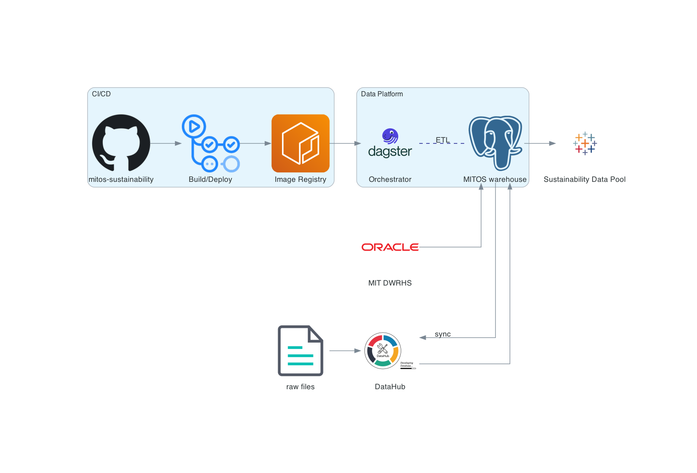

## Overview
The Basin data platform is an ETL orchestration platform featuring:
- A one-stop shop for monitoring all ETL processes.
- Capabilities to schedule and investigate the status, quality, and history of data assets.
- An accompanying self-hosted data catalog.
- A clear lineage of data dependencies.

## Infrastructure
The current deployment leverages several AWS services:
- An EC2 instance.
- An RDS Postgres server.
- An ECR container registry.

This CloudFormation template enables users to quickly set up the infrastructure required to deploy the codebase, including the necessary IAM roles and security group settings.

## Deployment
Once code changes are merged into the `main` branch, two GitHub Actions are triggered: the first builds and deploys the data catalog to a GitHub Page, and the second builds a Docker image, pushes the image to ECR, pushes the `docker-compose.yaml` file to the EC2 instance, and starts the service.

Since the codes are packaged into a Docker image, it is possible to deploy the image to other container services, such as AWS Elastic Container Service (ECS) or Kubernetes engines (EKS). Regarding the data warehouse, it is also possible to swap the RDS Postgres instance for other database technologies such as AWS Redshift or Google Cloud BigQuery.

For more details, please refer to `https://docs.dagster.io/deployment`.

## Tentative Deployment Steps
1. Create a `stack` using the `cloudformation_template.yaml`.
2. Create a `secret` to store neccessary environment variables using AWS secret manager.
3. Add `secrets` for github actions for some environment variables used in CI/CD.
